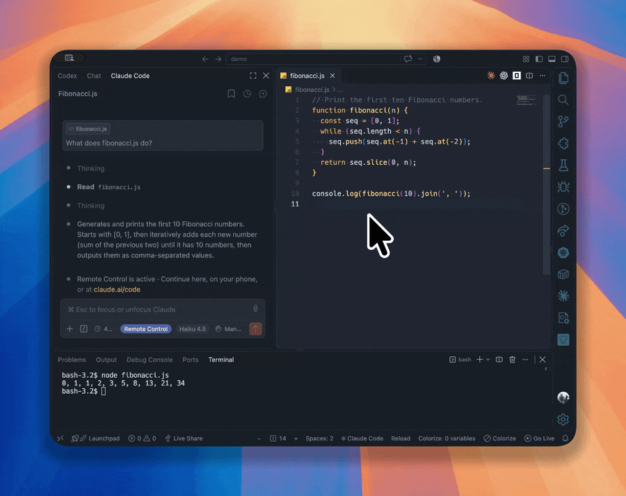

# Quick Font Size



Change the font size of the area you are working in, instead of zooming the whole window.

## Install

Available on the [VS Code Marketplace](https://marketplace.visualstudio.com/items?itemName=p3rception.quick-font-size), or run `ext install p3rception.quick-font-size` in Quick Open (`Cmd P` / `Ctrl P`).

## Supported Areas

<table>
<tr><td align="center"></td><td>Editor</td></tr>
<tr><td align="center"></td><td>Agent Chat (Codex, Copilot, Claude)</td></tr>
<tr><td align="center"></td><td>Terminal</td></tr>
<tr><td align="center"></td><td>Debug Console</td></tr>
<tr><td align="center"></td><td>Markdown Preview</td></tr>
</table>

## Keybindings

| Action                | macOS       | Windows            | Linux        |
| --------------------- | ----------- | ------------------ | ------------ |
| Increase focused area | `Cmd +`     | `Ctrl +`           | `Ctrl +`     |
| Decrease focused area | `Cmd -`     | `Ctrl -`           | `Ctrl -`     |
| Reset focused area    | `Cmd 0`     | `Ctrl 0`           | `Ctrl 0`     |
| Increase all areas    | `Cmd Option +` | `Ctrl Shift Alt +` | `Ctrl Alt +` |
| Decrease all areas    | `Cmd Option -` | `Ctrl Shift Alt -` | `Ctrl Alt -` |
| Reset all areas       | `Cmd Option 0` | `Ctrl Shift Alt 0` | `Ctrl Alt 0` |

Shift and numpad variants also work. To zoom the whole window, run **View: Zoom In** / **View: Zoom Out**.

## Status bar

`−  [icon] 14  +`

- `−` / `+`: change the size of the area shown.
- Click the size: choose which area to show.
- Hover the size: see every area's size, switch area, or reset one.
- Right-click the status bar to hide any of the three items.

## Settings

| Setting                 | Default |                        |
| ----------------------- | ------- | ---------------------- |
| `quickFontSize.step`    | `1`     | Size change per press. |
| `quickFontSize.minimum` | `6`     | Smallest size.         |
| `quickFontSize.maximum` | `100`   | Largest size.          |

## Troubleshooting

- `Cmd +` does nothing in the terminal: add this to your settings.

  ```json
  "terminal.integrated.commandsToSkipShell": ["quickFontSize.increase", "quickFontSize.decrease", "quickFontSize.reset"]
  ```

- Chat does not change: `chat.fontSize` needs a recent VS Code version.

## Technical details

- Settings changed: `editor.fontSize`, `chat.fontSize`, `terminal.integrated.fontSize`, `debug.console.fontSize`, `markdown.preview.fontSize`. Anything outside the other areas counts as the editor.
- Sizes are saved to your user settings. If a workspace overrides a size, the workspace value is changed instead.
- Pixel values of `editor.lineHeight` and `debug.console.lineHeight` scale with the font. Multiplier values are left alone.
- The status bar follows focus for editors, tabs and the terminal. For chat in the sidebar and the debug console, it switches on the first key press there, because VS Code reports no focus events for those views.
- Windows uses `Ctrl Shift Alt` for all areas because `Ctrl Alt 0` would catch `AltGr 0`, which types `}` on many keyboard layouts.
- Commands (Command Palette, category **Font Size**): `quickFontSize.increase`, `quickFontSize.decrease`, `quickFontSize.reset`, `quickFontSize.chooseArea`. Each takes an optional `area` argument: `editor`, `chat`, `terminal.integrated`, `debug.console`, `markdown.preview` or `*` for all. Without it, the command acts on the area in the status bar.

  ```json
  { "key": "cmd+alt+up", "command": "quickFontSize.increase", "args": { "area": "chat" } }
  ```

- Runs locally, so it works in Remote-SSH, WSL and Dev Container windows without a remote install.
- Area icons are [Codicons](https://github.com/microsoft/vscode-codicons) by Microsoft, licensed under [CC BY 4.0](https://creativecommons.org/licenses/by/4.0/).
